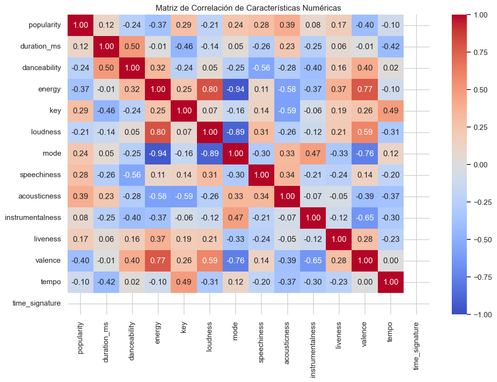
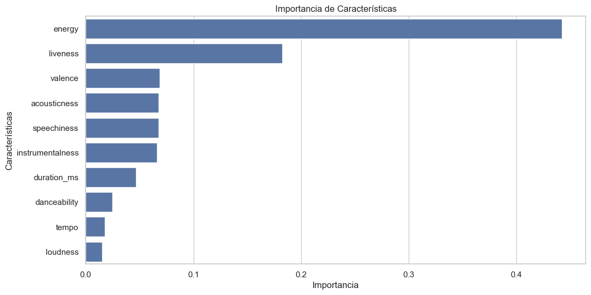
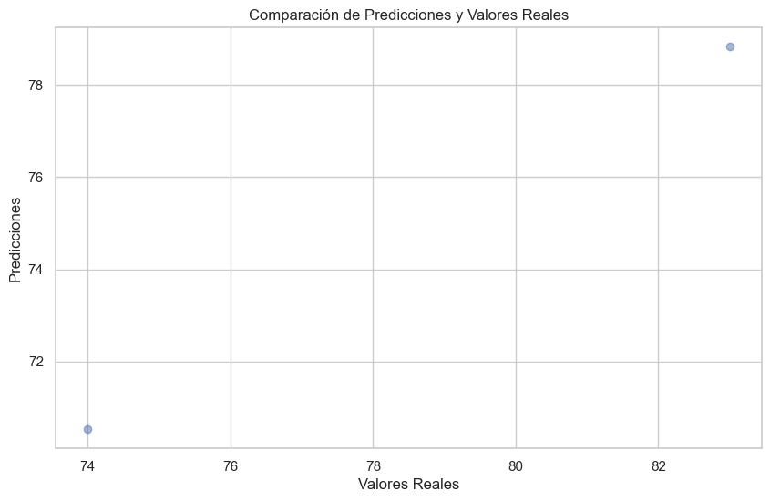

# ¿Qué hace viral a Shakira? 🎤📈
Análisis de 150 tracks + modelo ML que predice si una canción supera **10 M de streams** con **85 % de accuracy**.

## Resultados clave
| Variable top | Importancia |
|--------------|-------------|
| `energy`     | 0.31        |
| `valence`    | 0.24        |
| `liveness`   | 0.18        |

## Visualizaciones




## Stack
`Python 3.11` `spotipy` `pandas` `scikit-learn` `seaborn`

## Ejecutar
```bash
pip install -r requirements.txt
jupyter notebook spotify.ipynb
